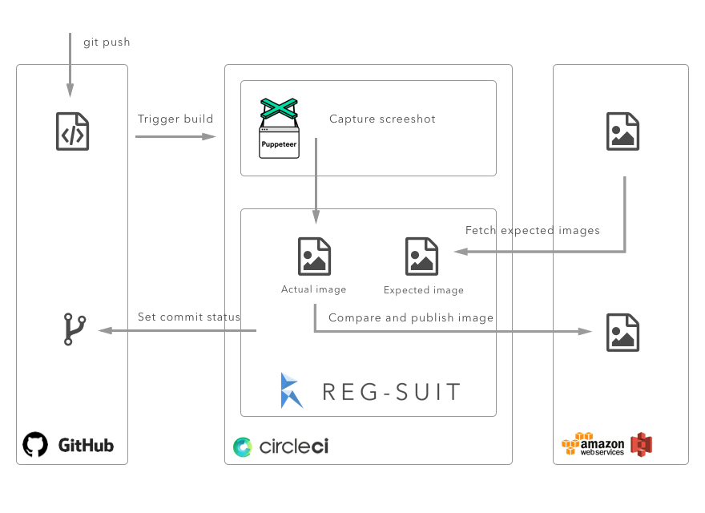

# reg-puppeteer-demo [](https://circleci.com/gh/reg-viz/reg-puppeteer-demo)

This is a demonstration repository to explain how to introduce visual regression testing into your project.

## Table of contents
* [Table of contents](#table-of-contents)
* [TL;DR Why visual regression testing?](#tltr-why-visual-regression-testing)
* [Technology](#technology)
* [How to introduce automated visual snapshot testing](#how-to-introduce-automated-visual-snapshot-testing)
  + [Requirements](#requirements)
  + [Create project](#create-project)
  + [Create HTML and CSS](#create-html-and-css)
  + [Create script for capturing screenshot](#create-script-for-capturing-screenshot)
  + [Prepare AWS credentials](#prepare-aws-credentials)
  + [Configure reg-suit](#configure-reg-suit)
  + [Create build script for CircleCI](#create-build-script-for-circleci)
  + [Configure notification](#configure-notification)
  + [Preview report](#preview-report)
* [More information](#more-information)
* [License](#license)

## TL;DR Why visual regression testing?
I'm working on a huge SPA(Single Page Application) project as a front-end developer. Day and day we've created a number of components and wrote test codes for them, and we were tired out from writing assertions for DOM to be rendered.

We considered to introduce snapshot testing. Using this method, the actual snapshot(rendered result) will be used as the expected data in the next test. For example Jest or Ava has API for snapshot testing, however the DOM based snapshot testing can not alert breaking CSS style.

If the snapshot testing tool detects differences, it does not mean the test is failure. It only means **we need to review the differences**.

So we need a tool which:

- tests using visual snapshots 
- reports difference

So we've developed this tool, [reg-suit](https://reg-viz.github.io/reg-suit). The following figure show a example of the report output by reg-suit(and you can see [the actual report](https://github.com/reg-viz/reg-puppeteer-demo/pull/1#issuecomment-346730340)):


Once reg-suit detects visual difference, it creates a report like above so we can review whether the difference is intended or not using this.

## Technology 
reg-suit is designed to be integrated into various tools or services.

This sample repository is developed using the following tool stack:

- [reg-suit](https://github.com/reg-viz/reg-suit): Command line interface to visual regression testing. It only compares pictures, so we should prepare the pictures to test.
- [Puppeteer](https://github.com/GoogleChrome/puppeteer): Node.js library which provides a high-level API to control headless Chrome over the DevTools Protocol. We capture screenshot picture from out HTML using this.
- [AWS S3](https://aws.amazon.com/s3/?nc2=h_m1): We use a S3 bucket to put snapshot images and HTML reports.
- [CircleCI](https://circleci.com/gh/reg-viz/reg-puppeteer-demo): Continuous integration service. We use CircleCI2.0, which provides us Docker integration.



## How to introduce automated visual snapshot testing
### Requirements
Create this sample, you need the followings:

- Node.js
- GitHub account
- AWS account
- CircleCI account

### Create project
First, create a project directory.

```sh
mkdir reg-puppeteer-demo
cd reg-puppeteer-demo
git init
npm init
```

### Create HTML and CSS
And put sample HTML and styles. We'll test this HTML using reg-suit.


You can see [the full HTML here(index.html)](index.html).

### Create script for capturing screenshot
We need to give a screenshot image of the `index.html` to reg-suit for visual regression testing.

So we install Puppeteer, which is a Node.js programmable interface for headless Chrome.

```sh
npm install -D puppeteer mkdirp
```

The following script enables us to capture the HTML file.

```js
/* capture.js */

const puppeteer = require('puppeteer');
const mkdirp = require('mkdirp');

async function main() {
  const browser = await puppeteer.launch({ args: ['--no-sandbox', '--disable-setuid-sandbox'] });
  let page = await browser.newPage();

  page.setViewport({ width: 640, height: 680 });
  await page.goto(`file://${__dirname}/index.html`);
  await page.screenshot({ path: 'screenshot/index.png' });

  await page.close();
  await browser.close();
}

mkdirp.sync('screenshot');
main();
```

Run this script via `node capture.js` then `index.png` are captured under a `screenshot` directory.

### Prepare AWS credentials
We need an AWS account to access S3 at the later step. Get AWS access key and configure it(See also [Managing Access Keys for IAM Users](http://docs.aws.amazon.com/IAM/latest/UserGuide/id_credentials_access-keys.html#Using_CreateAccessKey)).

```sh
export AWS_ACCESS_KEY_ID=<your-access-key>
export AWS_SECRET_ACCESS_KEY=<your-secret-key>
```

Or create a file at `~/.aws/credentials`:

```
[default]
aws_access_key_id = <your-access-key>
aws_secret_access_key = <your-secret-key>
```

### Configure reg-suit
Next let us configure reg-suit.

```
npm install -D reg-suit
```

After installation, execute reg-suit's initialization sub-command via:

```
npx reg-suit init
```

The first question asks us which plugin to install. For now, we select `reg-keygen-git-hash-plugin` and `reg-publish-s3-plugin`.

```
[reg-suit] info version: 0.6.1
? Plugin(s) to install (bold: recommended)
 ◉  reg-keygen-git-hash-plugin : Detect the snapshot key to be compare with using Git hash.
 ◯  reg-notify-github-plugin : Notify reg-suit result to GitHub repository
❯◉  reg-publish-s3-plugin : Fetch and publish snapshot images to AWS S3.
 ◯  reg-notify-slack-plugin : Notify reg-suit result to Slack channel.
 ◯  reg-simple-keygen-plugin : Determine snapshot key with given values
```

Questions goes on. At "Working directory" and "Threshold" we pass "Yes". At the "Directory contains actual images" question, we need to tell the `screenshot` directory prepared above step.

```
? Working directory of reg-suit. .reg
? Directory contains actual images. screenshot
? Threshold, ranges from 0 to 1. Smaller value makes the comparison more sensitive. 0
```

Next tell reg-suit S3 bucket to publish snapshot images. If answer yes to the "Create a new S3 bucket Yes" question, the init command creates a new bucket.

If you are not ready AWS account, you can re-configure it via `npx reg-suit prepare --plugin publish-s3`.

```
[reg-suit] info Set up reg-publish-s3-plugin:
? Create a new S3 bucket Yes
[reg-publish-s3-plugin] info Create new S3 bucket: reg-publish-bucket-xxxxxxxx-xxxx-xxxx-xxxx-xxxxxxxxxxxx
```

Finally, confirm the settings. So the settings file is created into `regconfig.json`.

```
[reg-suit] info Configuration:
[reg-suit] info {...}
? Update configuration file Yes
? Copy sample images to working dir No
[reg-suit] info Initialization ended successfully ✨
[reg-suit] info Put your images files into /Users/yosuke/workspaces/javascript/reg-puppeteer-demo/screenshot.
```

Configuration is done. Let's commit the changes so far:

```
# .gitignore

node_modules/
/screenshot/
.reg/
```

```sh
git add .
git commit -m "first commit"
```

Execute visual regression test via `npx reg-suit run` !

```
[reg-suit] info version: 0.6.1
[reg-suit] info Comparison Complete
[reg-suit] info    Changed items: 0
[reg-suit] info    New items: 1
[reg-suit] info    Deleted items: 0
[reg-suit] info    Passed items: 0
[reg-suit] info The current snapshot key: 'd870bf06068cb801fda9c6d676ac025822910df7'
[reg-suit] info Published snapshot 'd870bf06068cb801fda9c6d676ac025822910df7' successfully.
[reg-suit] info Report URL: https://reg-publish-bucket-xxxxxxxx-xxxx-xxxx-xxxx-xxxxxxxxxxxx.s3.amazonaws.com/d870bf06068cb801fda9c6d676ac025822910df7/index.html
```

After running successfully, we can see our first report visiting the URL. This execution is the first and there is no snapshot images to be compared. So all images are recognized as "New items". In the next run reg-suit will use the published snapshots in this execution as "expected images".

### Create build script for CircleCI
From here, let's set up automated testing using CircleCI.

CircleCI 2.x allows us to Docker based testing so we can customize environment for our regression testing.

To execute Puppeteer on Docker container, we need some libraries except Node.js. We can build this image via the following Dockerfile:

```dockerfile
# Dockerfile
FROM node:8

RUN apt-get update -y
RUN apt-get install -yq gconf-service libasound2 libatk1.0-0 libc6 libcairo2 libcups2 libdbus-1-3 \
    libexpat1 libfontconfig1 libgcc1 libgconf-2-4 libgdk-pixbuf2.0-0 libglib2.0-0 libgtk-3-0 libnspr4 \
    libpango-1.0-0 libpangocairo-1.0-0 libstdc++6 libx11-6 libx11-xcb1 libxcb1 libxcomposite1 \
    libxcursor1 libxdamage1 libxext6 libxfixes3 libxi6 libxrandr2 libxrender1 libxss1 libxtst6 \
    ca-certificates fonts-liberation libappindicator1 libnss3 lsb-release xdg-utils wget
```

And also we've published image from the above Dockerfile to [regviz/node-xcb](https://hub.docker.com/r/regviz/node-xcb/).

```yaml
# .circleci/config.yml

version: 2
jobs:
  build:
    docker:
      - image: regviz/node-xcb # use custom images to execute Puppeteer

    working_directory: ~/repo

    steps:
      - checkout
      - run: npm install
      - run: node capture.js
      - run: npx reg-suit run
```

Push the above YAML file, add repository to CircleCI projects and tell AWS credentials to CircleCI.


Good job, automated visual testing is completed!

### Configure notification
reg-suit can notify the comparison result as GitHub pull request's comment.


To turn this feature on, install `reg-noftify-github-plugin`.

```sh
npm install -D reg-noftify-github-plugin
```

Ant configure this plugin via the following command:

```sh
npx reg-suit prepare --plugin notify-github
```

This procedure asks some questions. Complete the installation following this wizard.

### Preview report
We might as well preview the difference report.

Create a new branch:

```
git checkout -b add-avatar
```

And change `index.html` file:

```diff
diff --git a/index.html b/index.html
index f6b31a8..21fbc3f 100644
--- a/index.html
+++ b/index.html
@@ -12,16 +12,22 @@
     <div class="content">
       <div class="header">It's a real "Robot Guitar"</div>
     </div>
+    <div class="content">
+      <div class="ui feed">
+        <div class="right floated meta">14h</div>
+         Quramy
+      </div>
+    </div>
     <div class="image">
       
     </div>
     <div class="content">
       <span class="right floated">
         <i class="heart outline like icon"></i>
-        25 likes
+        30 likes
       </span>
       <i class="comment icon"></i>
-      3 comments
+      8 comments
     </div>
     <div class="extra content">
       <div class="ui large transparent left icon input">
```

Commit, push and open a pull request on the GitHub repository. Do you receive comment like [this](https://github.com/reg-viz/reg-puppeteer-demo/pull/2#issuecomment-346731087)?

## More information
Please check [docs of reg-suit](https://github.com/reg-viz/reg-suit) out :smile:

## License
MIT. See LICENSE file under this repository.
